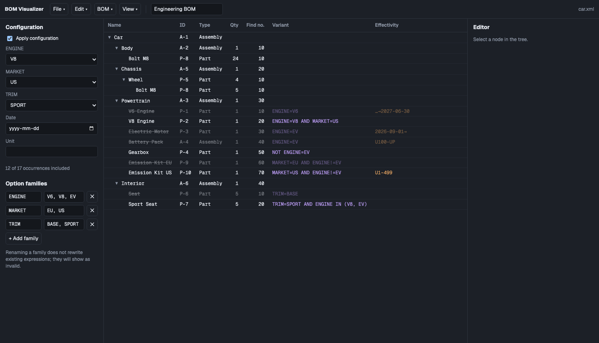

# BOM Visualizer

Lightweight browser sandbox for trying out BOM concepts: multi-level structures, **variant expressions** and **effectivity** on parent→child relations, shown as an indented tree-table. Runs fully offline.



## Features

- Several BOMs per document (e.g. EBOM + MBOM) sharing items and variant families.
- Items have an editable ID and a type from a per-document list (Part, Assembly, Station by default; add your own from the editor).
- BOM alignment (BOM > Align with): the active BOM and another BOM side by side, read-only, with lines between aligned occurrences (dashed when an end is inside a collapsed row). Select a row on each side and click Align; remove from the side panel. Unaligned rows are marked and coverage is counted. Removing or moving a relation removes the alignments of the occurrences it affects.
- Variant expressions on relations: `ENGINE=V8 AND (MARKET=EU OR TRIM IN (BASE, SPORT))`, with live validation and suggestions while typing (families, operators, values, AND/OR; ↑/↓, Enter/Tab to pick, Esc to close). Names with spaces are written in double quotes: `"Engine type"="V6 Turbo"`. Renaming a family or value updates the expressions that use it.
- Effectivity on relations: date range and unit range, open-ended bounds.
- Configuration panel: pick option values, date and unit; excluded rows are dimmed and struck through (hover for the reason).
- File-tree style structure with ID / Type / Qty / Find no. / Variant / Effectivity columns: click ▸/▾ to collapse, click a row to edit, double-click a cell (except Effectivity) to edit it in place (Enter saves, Esc cancels, Tab / Shift+Tab moves to the next cell right / left, wrapping to the next / previous row), ↑/↓ to move, ←/→ to collapse/expand.
- Drag and drop rows: onto a row to make it the parent, onto a row's top/bottom edge to place before/after it (find number is set in between, renumbering siblings only when there is no gap). Hold Ctrl or Alt/Option when dropping to copy instead of move. Qty, variant and effectivity are kept; cycles are rejected. Children are shown sorted by find number.
- Undo / redo of document edits (Edit menu, Cmd/Ctrl+Z, Cmd/Ctrl+Shift+Z, Ctrl+Y); up to 100 steps, cleared on New/Open. Configuration, selection and collapse are not undo steps.
- Autosave: every document change is kept in localStorage and restored on the next start. New/Open replace it. The link to the file on disk is not kept, so the first Save after a reload asks where to save.
- View menu: Theme (System — default, follows the OS live — Light or Dark), Columns (show/hide each column except Name), Banded rows, and show/hide the Configuration and Editor panels; all remembered in localStorage.
- File > Close closes the document. In Chrome/Edge (where Save writes back to the file), Close, New, Open and leaving the page ask to save unsaved changes first. A • before the file name (toolbar and browser tab title) marks unsaved changes.
- Open/save as XML — see [docs/schema.md](docs/schema.md).

## Use

- **Online:** GitHub Pages (see Deploy below).
- **Offline:** `npm run build`, then open `dist/index.html` directly — it is a single self-contained file (JS and CSS inlined), so it works from `file://` and can be copied anywhere.

## Develop

Requires Node (version in `.nvmrc`).

```sh
npm install
npm run dev        # dev server with hot reload
npm test           # unit tests (Vitest)
npm run typecheck
npm run build      # -> dist/index.html
```

Code map:

| Path | Role |
|---|---|
| `src/model.ts` | Data model, mutators, occurrence addresses, document validation |
| `src/expr.ts` | Variant expression parser / validator / evaluator |
| `src/effectivity.ts` | Date / unit effectivity |
| `src/resolve.ts` | Expands a BOM into occurrences and applies the configuration |
| `src/xml.ts` | XML read / write |
| `src/ui/*` | Tree-table, config panel, editor, toolbar |
| `src/samples/car.xml` | Sample loaded on start |

## Deploy

The workflow in `.github/workflows/deploy.yml` type-checks, tests, builds and deploys on every push to `main`. One-time setup: **Settings → Pages → Source: GitHub Actions**.

## Roadmap

See [docs/suggested-features.md](docs/suggested-features.md).
